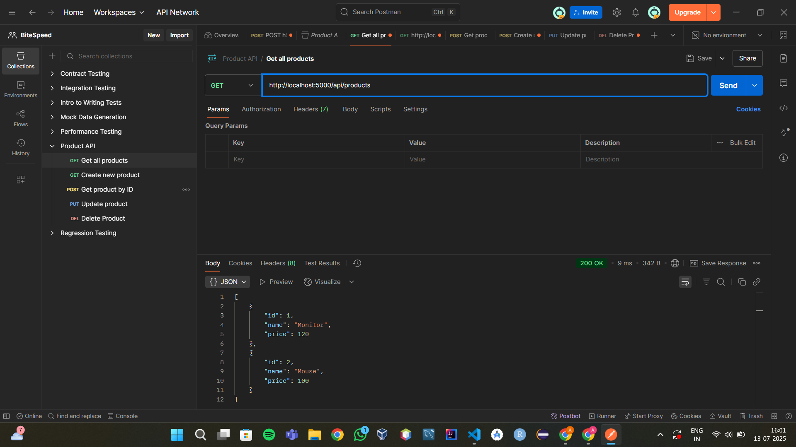
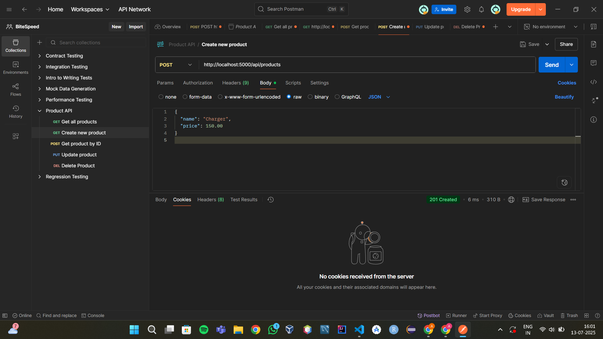
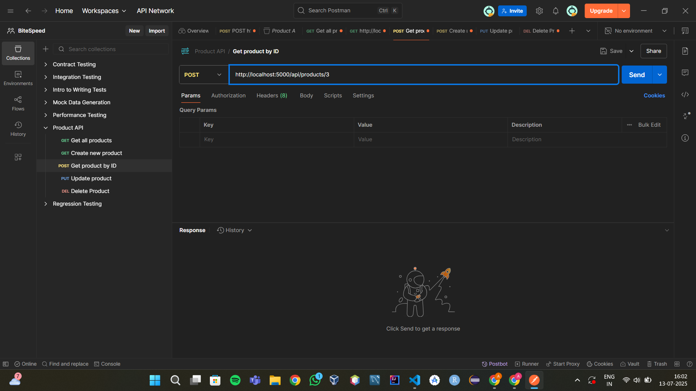
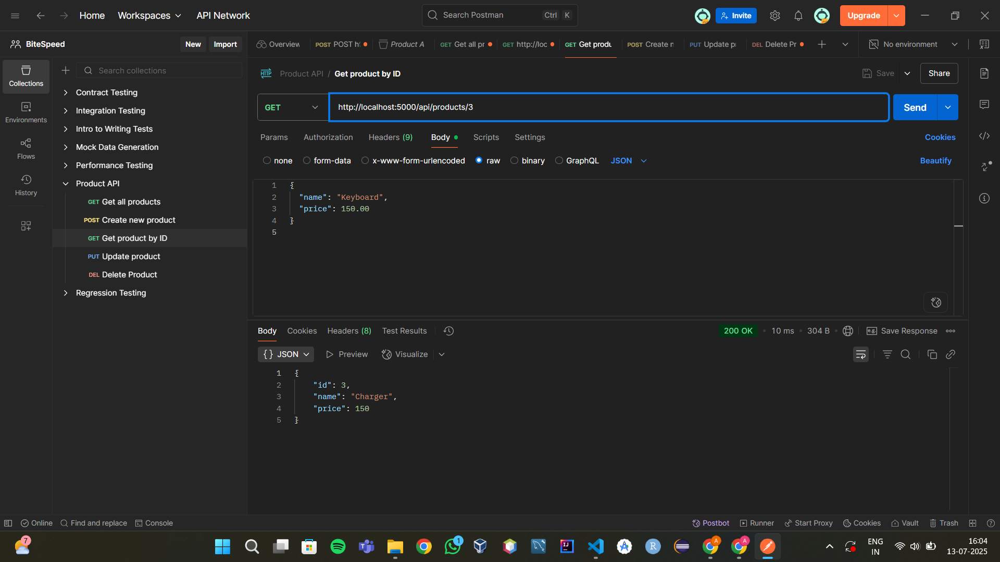
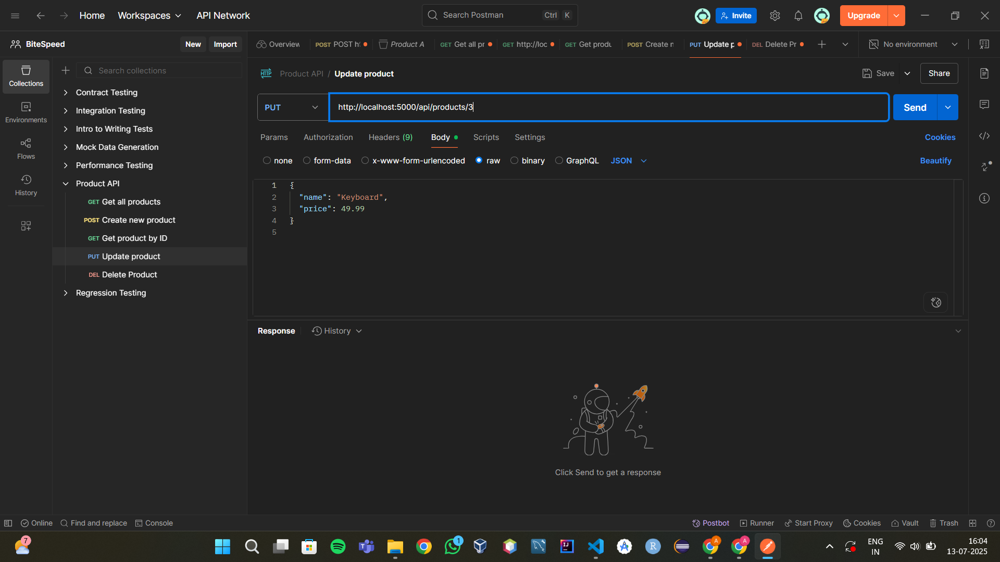
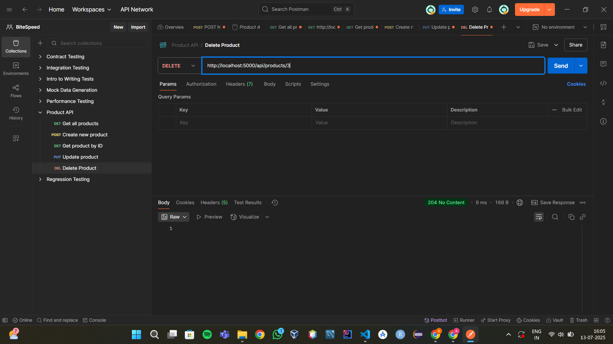

# CSI-Assignment 6  
# 🛍️ Product REST API

A clean and modular RESTful API built with **Node.js + Express** to manage a collection of products with full CRUD functionality. Designed with validation, middleware, and maintainability in mind.

---

## 🚀 Features

- ✅ RESTful endpoints for managing products  
- ✅ Input validation using **Joi**  
- ✅ Custom middleware for logging and error handling  
- ✅ Simple in-memory data structure (no DB required)  
- ✅ Clean and scalable file structure  
- ✅ Fully tested using Postman

---

## 🗂️ Tech Stack

- **Node.js**
- **Express.js**
- **Joi** – Schema validation
- **Morgan** – HTTP request logger
- **Dotenv** – Environment variable management
- **Nodemon** – Dev server auto-reload

---

## 📁 Project Structure

```bash
product-api/
├── src/
│   ├── controllers/       # Business logic
│   ├── routes/            # Route definitions
│   ├── middleware/        # Logger & error handler
│   ├── validation/        # Joi schemas
│   ├── data/              # In-memory product list
│   └── server.js          # Entry point
├── .env                   # Port configuration
├── .gitignore             # Ignore node_modules & env
├── package.json           # Scripts and dependencies
└── README.md              # Project overview
```
## ⚙️ Installation & Running the Server

```bash
# 1. Clone or unzip the repo
cd product-api

# 2. Install dependencies
npm install

# 3. Run the development server
npm run dev   # or use npm start for production
```
- Server runs on: 👉 http://localhost:5000

| Method | Endpoint            | Description          |
| ------ | ------------------- | -------------------- |
| GET    | `/api/products`     | Get all products     |
| GET    | `/api/products/:id` | Get a product by ID  |
| POST   | `/api/products`     | Create a new product |
| PUT    | `/api/products/:id` | Update a product     |
| DELETE | `/api/products/:id` | Delete a product     |


## 📦 Sample JSON Payload
✅ POST / PUT Body Format
{
  "name": "Wireless Mouse",
  "price": 24.99
}

## 🧪 Postman Testing
All endpoints were tested using Postman, including:

✅ Success responses with correct status codes (200, 201, 204)

✅ Error responses for invalid inputs (400, 404)

✅ Real-time updates in the in-memory product list

## 📸 Screenshots

| Operation                 | Screenshot                                                  |
|---------------------------|-------------------------------------------------------------|
| ✅ GET all products        |              |
| ✅ POST Add new product    |                  |
| ✅ POST response           |                          | 
| ✅ GET product by ID       |                 |
| ✅ Product found response  |                              |
| ✅ PUT update product      |                     |
| ✅ PUT response            |                          |
| ✅ DELETE product request  |                     |

---